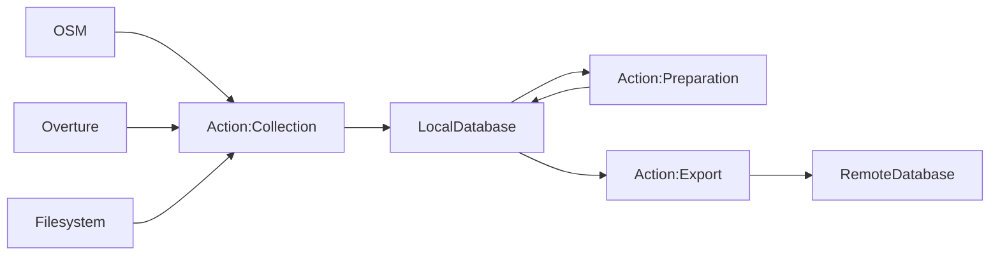

# Data Preparation
A collection of scripts that fetch, process and export various geospacial datasets for GOAT.

# Overview

The scripts contained within this repository have three primary functions (also known as *actions*):

### Collection
The data collection action will fetch datasets from remote sources such as OSM, Overture, or a local directory. It will then import this data into the local data_preparation database for further preparation.

### Preparation
The data preparation action will prepare the data using disaggregation, integration, or fusion techniques. It reads data from the local data_preparation database and writes the results once prepared.

### Export
The data export action will export data from the local data_preparation database to a remote target database or an output file.

# Setup

1. Create your personal .env from .env.template
2. Create your personal id.rsa and id.rsa.pub from the templates
3. Run `docker-compose up -d`
4. Work inside the docker container
5. Init the database with `python initdb.py`

# Using the CLI

Execute `manage.py` at the root of this repository along with the following options to run the pipeline.

`--action` or `-a`
`--data-set` or `d`
`--region` or `-r`

The different actions can be executed by the `--action` or `-a` argument. Each action can be used individually or in combination. Each action will be performed on one or more datasets. The supported datasets are currently:

Collection:
- building
- poi
- landuse
- network
- network_pt
- gtfs
- overture
- osm_pt_lines

Preparation:
- building
- population
- poi
- poi_overture
- network
- network_pt
- network_overture
- gtfs
- gtfs_stops
- gtfs_stations
- overture
- osm_pt_lines

The data sets can be defined by the `--data-set` or by `-d` argument.

A region can be defined by `--region` or `-r`. A region can be understood as geographical area such as a country or state. The CLI will use the region and data-set tag to find the associated configuration file inside the `config/data_variables` folder. There should be a check whether the configuration file exists. If not, the CLI should exit with an error message. 

It should be possible to chain the different process. So it should be possible to execute the collection, preparation and export action in one command. It is important that the processes are executed in the order: collection, preparation and export. Furthermore it should be possible to execute the command for multiple datasets at once.
