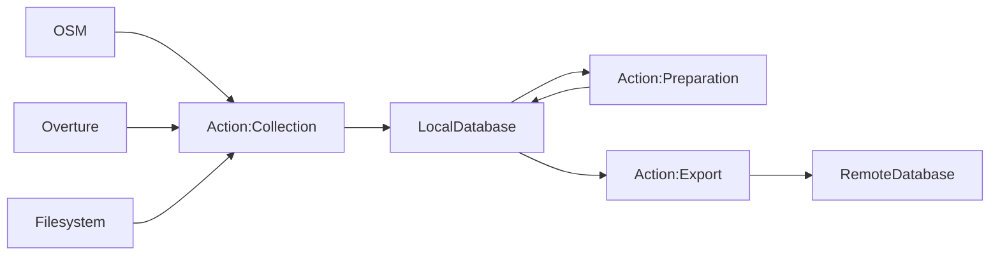

# Data Preparation
A collection of scripts that fetch, process and export geospatial datasets for GOAT.

# Overview

The scripts contained within this repository have three primary functions (also known as *actions*):

### Collection
The data collection action will fetch datasets from remote sources such as OSM, Overture, or a local directory. It will then import this data into the local data_preparation database for further preparation.

### Preparation
The data preparation action will prepare the data using disaggregation, integration, or fusion techniques. It reads data from the local data_preparation database and writes the results once prepared.

### Export
The data export action will export data from the local data_preparation database to a remote target database or an output file.

# Setup

1. Create your personal `.env` environment file from `.env.template`
2. Run `docker-compose up -d`
3. Work inside the docker container
4. Initialise a local database by running `python initdb.py`
5. Orchestrate the data preparation pipeline via the `manage.py` CLI

# Using the CLI

Execute `manage.py` at the root of this repository along with the following options to run the pipeline. Multiple actions and datasets may be strung together to be run sequentially. It is however important that the pipeline is executed in the order: collection, preparation and export.

`--actions` or `-a`

`--datasets` or `-d`

`--region` or `-r`

### Supported actions
Actions may be performed individually or strung together to be run sequentially.

- collection
- preparation
- export

### Supported datasets
Datasets may be processed individually or strung together to be run sequentially.

#### Collection
- building
- poi
- landuse
- network
- network_pt
- gtfs
- overture
- osm_pt_lines

#### Preparation
- building
- population
- poi
- poi_overture
- network
- network_pt
- network_overture
- gtfs
- gtfs_stops
- gtfs_stations
- overture
- osm_pt_lines

### Supported regions

Regions typically refer to geographical areas such as countries or states. The CLI will use the region and dataset tag to find the associated configuration file within the `config/data_variables` folder. If an appropriate region configuration file does not exist, the CLI will exit with an error message. Only one region may be specified at a time.
