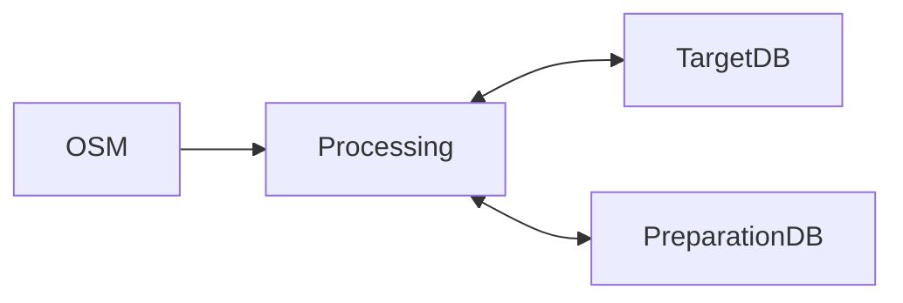

# Data preparation
This is a repository containing the data preparation steps for GOAT. 

# Start Database Docker Container and Connect

1. Create your personal .env from .env.template
2. Create your personal id.rsa and id.rsa.pub from the templates
3. Run `docker-compose up -d`
4. Work inside the docker container

# Data Preparation CLI

We are running data preparation scripts that involve data from three locations. It reads data from OpenStreetMap(OSM) using predefined URLs to the planet OSM files. Furthermore, it interacts with a target database, which acts as the rawdatabase and is supposed to be a remote database. It is used to manage the data for GOAT. Meanwhile, for temporary storage a local Preparation Database is used. The data preparation process is visualized in the following diagram. 

The Data Preparation CLI is a command line interface to orchestrate the data preparation process. It consist of three main actions: 
- collection
- preparation 
- export. 

The different actions can be executed by the `--action` or `-a` argument. Each action can be used individually or in combination. Each action will be performed on one or more data sets. The supported data sets are currently:

- network 
- poi 
- population
- building 
- landuse
- public_transport_stop

The data sets can be defined by the `--data-set` or by `-d` argument. A region can be defined by `--region` or `-r`. A region can be understood as geographical area such as a country or state. The CLI will use the region and data-set tag to find the right configuration file inside the `config/data_variables` folder. There should be a check whether the configuration file exists. If not, the CLI should exit with an error message. 

It should be possible to chain the different process. So it should be possible to execute the collection,preparation and export action in one command. It is important that the processes are execute in the order: collection, preparation and export. Furthermore it should be possible to execute the command for multiple data sets at once. 

### Collection
The data collection action will collect the data mostly from OSM and perform the classification specified in the config files. 

### Data Preparation
The data preparation action will prepare the data using fusing, disaggregation and integration techniques. It might read data from the target database and write the results back to the data preparation database.

### Export
As the name suggests, the export action will export the data from the data preparation database to the target database.

# Import GTFS data

docker run --rm --network=data_preparation_data_preparation_proxy --volume $(pwd)/src/data/gtfs:/gtfs -e PGHOST={PGHOST} -e PGPASSWORD={PGPASSWORD} -e PGUSER={PGUSER} -e PGDATABASE={PGDATABASE} majkshkurti/gtfs-via-postgres:4.3.4 --trips-without-shape-id --schema gtfs  -- *.txt"
